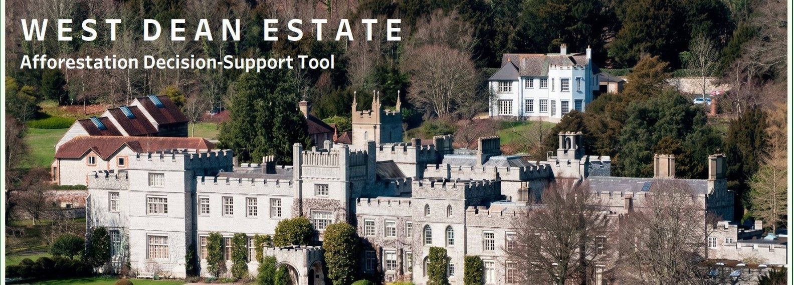
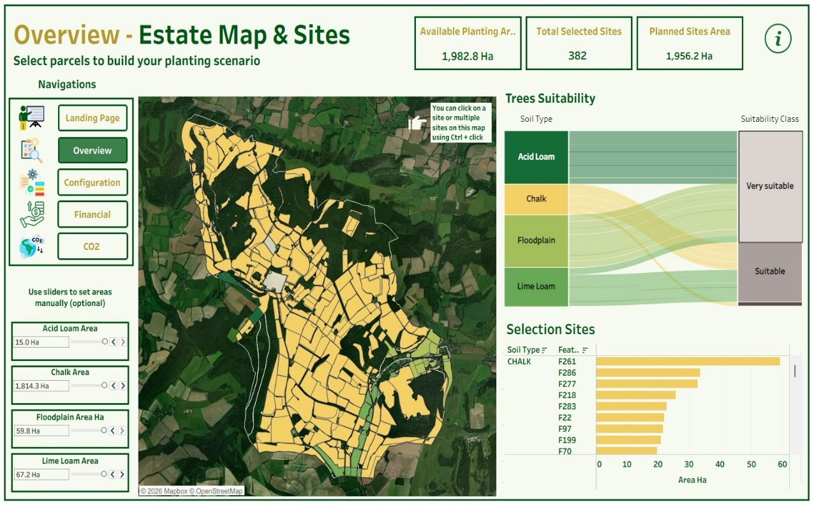
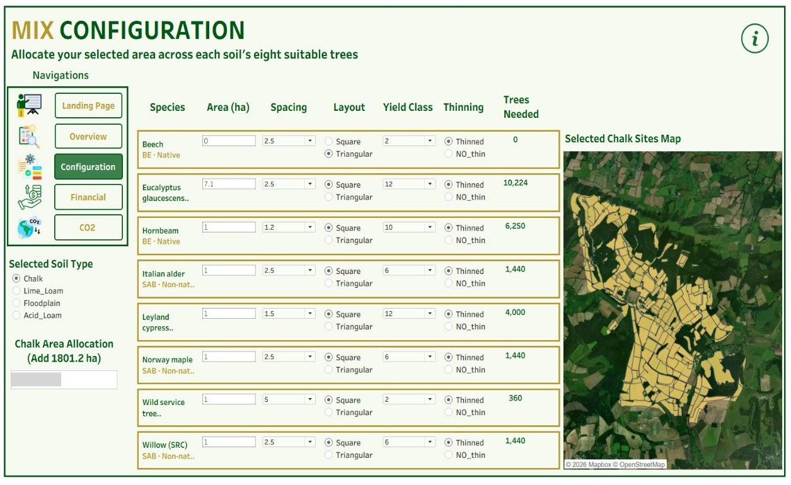
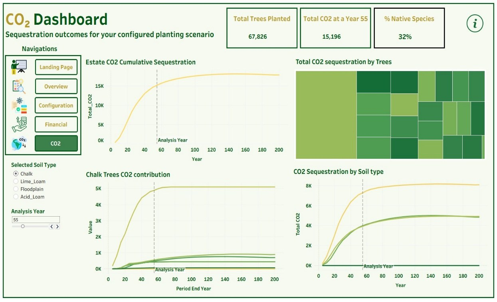
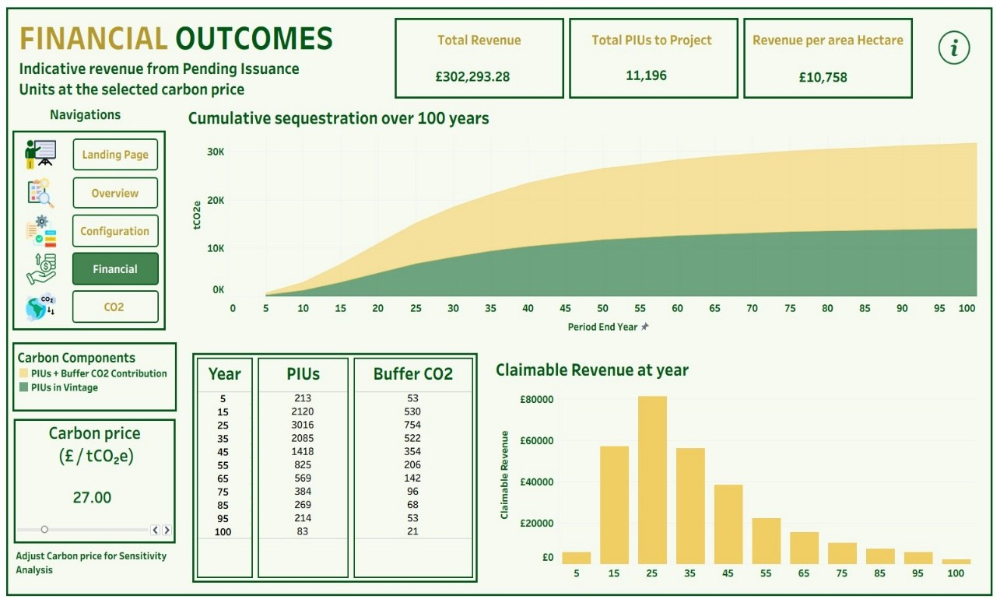
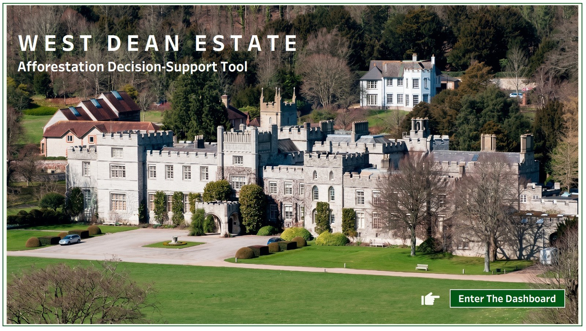
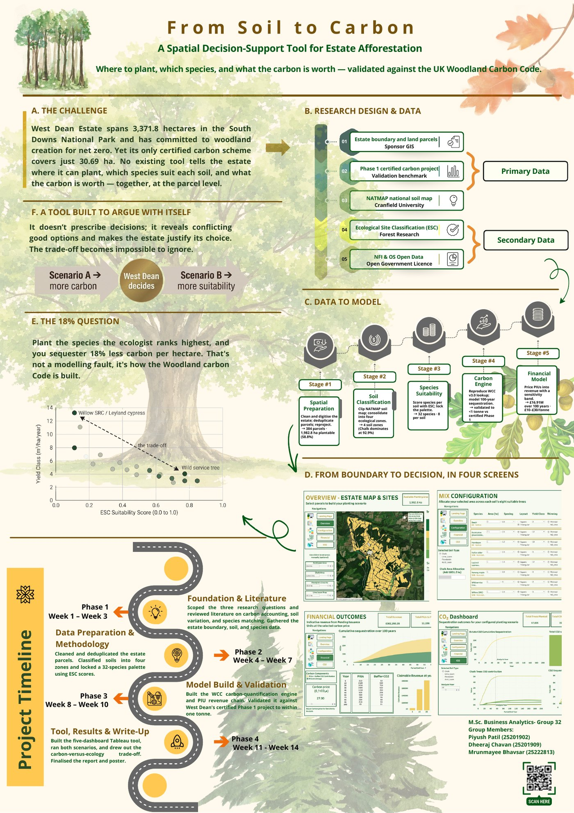

<p align="center">
  
</p>

<h1 align="center">Afforestation Leveraging the UK Woodland Carbon Code</h1>

<p align="center">
  <b>A spatial carbon decision-support tool for estate-scale afforestation planning at West Dean Estate</b><br>
  <sub>MSc Business Analytics Capstone · UCD Michael Smurfit Graduate Business School · 2025/26 · Group 32</sub>
</p>

<p align="center">
  <a href="https://public.tableau.com/app/profile/piyush.patil6025/viz/WestDeanEstateDSS/LandingPage"></a>
  <a href="assets/poster/West_Dean_DSS_Poster_A1.pdf"></a>
  <a href="docs/01_methodology.md"></a>
</p>

<p align="center">
  
  
  
  
  
  
</p>

---

## At a glance

West Dean Estate wants to plant new woodland for net zero, but had no way to answer three linked questions together: **where** it can plant, **which species** suit each soil, and **what the carbon is worth**. We built a validated, interactive Tableau tool that answers all three at the level of individual land parcels.

<table>
<tr>
<td align="center" width="20%"><h3>1,982.8 ha</h3><sub>plantable land<br>(58.8 % of 3,371.8 ha)</sub></td>
<td align="center" width="20%"><h3>384</h3><sub>candidate parcels<br>across 4 soil zones</sub></td>
<td align="center" width="20%"><h3>32</h3><sub>species, 8 locked<br>to each soil</sub></td>
<td align="center" width="20%"><h3>&lt; 1 t</h3><sub>difference vs the certified<br>Phase 1 project, 100 yrs</sub></td>
<td align="center" width="20%"><h3>18 %</h3><sub>less carbon per hectare<br>when curating for ecology</sub></td>
</tr>
</table>

---

## Contents

- [The problem](#the-problem)
- [Research questions](#research-questions)
- [The tool](#the-tool)
- [How it works](#how-it-works)
- [Validation](#validation)
- [Key findings](#key-findings)
- [Recommendations](#recommendations)
- [The poster](#the-poster)
- [Repository structure](#repository-structure)
- [Reproduce the numbers](#reproduce-the-numbers)
- [Tech stack](#tech-stack)
- [Team](#team)
- [Acknowledgements](#acknowledgements)
- [Citation and licence](#citation-and-licence)

---

## The problem

West Dean Estate is a 3,371.8-hectare working landscape of chalk downland, woodland, farmland and parkland in the South Downs National Park, owned by the Edward James Foundation. Its sustainability policy names woodland creation as a main route to net zero, and its first afforestation scheme, **30.69 ha**, is already certified under the UK Woodland Carbon Code (WCC).

Planning the next phases is a chain of decisions, each with its own data, rules and uncertainty. The literature treats site selection, species-to-site matching, carbon accounting and carbon pricing separately, and the WCC publishes lookup tables but no estate workflow. **No tool joined them up for one estate, parcel by parcel.** That is the gap this project fills.

## Research questions

| | Question | Answer in one line |
|:-:|---|---|
| **RQ1** | Where can new woodland go, and how much plantable area is there, by soil? | 1,982.8 ha across 384 parcels; Chalk is 92.9 % of it |
| **RQ2** | Which species suit each site, and what carbon follows under the WCC? | A 32-species locked palette; 317.6 t/ha (equal split) vs 259.2 t/ha (top-4 by ecology) |
| **RQ3** | What is the carbon worth under WCC prices and the PIU mechanism? | £16.91 M over 100 years for the full area at £26.85 / t, with a 3× price band and back-loaded timing |

---

## The tool

Five linked Tableau dashboards, 166 parameters, map-driven parcel selection and live recomputation.
**[▶ Open it on Tableau Public](https://public.tableau.com/app/profile/piyush.patil6025/viz/WestDeanEstateDSS/LandingPage)** · [Full dashboard guide](docs/02_dashboard_guide.md)

<table>
<tr>
<td width="50%" valign="top">
<a href="docs/02_dashboard_guide.md#2--overview--estate-map--sites"></a>
<b>Overview</b> · click parcels on the estate map to set how much of each soil zone to plant
</td>
<td width="50%" valign="top">
<a href="docs/02_dashboard_guide.md#3--mix-configuration"></a>
<b>Mix Configuration</b> · allocate each soil's area across its 8 locked species
</td>
</tr>
<tr>
<td width="50%" valign="top">
<a href="docs/02_dashboard_guide.md#4--co2-dashboard"></a>
<b>CO₂</b> · sequestration at estate, soil and species level over time
</td>
<td width="50%" valign="top">
<a href="docs/02_dashboard_guide.md#5--financial-outcomes"></a>
<b>Financials</b> · PIUs, buffer and revenue by vintage, with a £10–£30 price slider
</td>
</tr>
</table>

<details>
<summary><b>Landing page</b></summary>
<br>

</details>

---

## How it works


| Stage | What we did | Output |
|---|---|---|
| **1 · Spatial preparation** | Overlaid NFI, OS buildings/roads and farmland layers on the boundary; hand-digitised the rest; removed 28 duplicate fields with a greedy non-maximum-suppression algorithm (τ = 0.5), correcting 212.6 ha of double counting; reprojected to British National Grid | **384 parcels, 1,982.8 ha** |
| **2 · Soil classification** | Clipped NATMAP to the estate; merged six soil series into four zones with identical ESC inputs | **Chalk 92.9 %**, Lime Loam 3.4 %, Floodplain 3.0 %, Acid Loam 0.8 % |
| **3 · Species suitability** | Queried Forest Research ESC per zone, fixing ESC's calcareous defaults for the three non-chalk soils; locked 8 species per soil, largest soil choosing first | **32-species palette** |
| **4 · Carbon engine** | Reproduced the WCC v3.0 biomass lookup verbatim; applied the Code's crediting chain | **Claimable PIUs by vintage** |
| **5 · Financial model** | Priced PIUs at £26.85 / t with a £10–£30 sensitivity band | **Indicative revenue and timing** |

The crediting chain, in one line:

$$\text{PIU}_{\text{total}} = 0.64 \cdot Q_{\text{estate}}(100) - 0.80 \cdot L_b \qquad \text{e.g. } 0.64 \times 983{,}882 - 0.80 \times 60 = 629{,}636\ \text{tCO}_2\text{e}$$

where the two 0.8 factors are the Code's model-precision reduction and the 20 % buffer, and $L_b = 60$ tCO₂e is the lumped baseline-and-leakage deduction from the certified Phase 1 record. **[Full methodology, formulas and Algorithm 3.1 →](docs/01_methodology.md)**

---

## Validation

The carbon engine was run on the inputs of West Dean's **WCC-certified Phase 1 project** (30.69 ha, 25-species native broadleaf mix) and compared vintage by vintage with the certified figures.

| Vintage | 5 | 15 | 25 | 35 | 45 | 55 | 65 | 75 | 85 | 95 | 100 | **Total** |
|---|--:|--:|--:|--:|--:|--:|--:|--:|--:|--:|--:|--:|
| Tool PIUs | 18 | 702 | 1,986 | 1,446 | 820 | 515 | 335 | 221 | 145 | 95 | 27 | **6,310** |
| Certified PIUs | 18 | 701 | 1,986 | 1,446 | 820 | 515 | 335 | 221 | 145 | 95 | 27 | **6,309** |

**Within one tonne at every vintage (+1 t, 0.02 %, over 100 years).** Because the tool reproduces an independently certified result, every other figure it produces rests on the Code's own arithmetic rather than our assumptions.

---

## Key findings

**1. Land is not the limit.** The plantable inventory is 65 times the certified Phase 1 scheme. What constrains the estate is decision-making, not space.

**2. Chalk shapes everything.** At 92.9 % of plantable area, chalk produces about 96 % of the carbon. That makes the three small soils the estate's only real route to species diversity.

**3. Carbon and ecology genuinely trade off.** Two team-designed scenarios bracket the tool's range:

| | Scenario A · full area, equal split | Scenario B · 200 ha, top-4 species by ESC |
|---|--:|--:|
| Claimable PIUs at year 100 | 629,636 t | 51,841 t |
| **PIUs per hectare** | **317.6 t** | **259.2 t (−18 %)** |
| Revenue at £26.85 / t | £16.91 M | £1.39 M |
| Revenue per hectare | £8,528 | £6,960 |

The WCC credits carbon by **yield class (growth rate), not ecological suitability**, and on chalk the most suitable species grow more slowly. Applied to the whole inventory, curating for ecology would cost about **£3.11 M** in carbon revenue. The tool does not hide that conflict behind a single recommendation; it puts a price on it so the estate can choose knowingly.

<p align="center"></p>

**4. Price rules the return.** Revenue moves by a factor of three across the observed £10–£30 market range (about ±40 %), more than any species choice moves it at a given scope.

**5. Carbon income arrives late.** Years 25 and 35 deliver about half of 100-year revenue; only about 13 % lands in the first 15 years, so planting has to be grant-funded up front.

<p align="center"></p>

**[All result tables and scenario charts →](docs/03_results.md)**

---

## Recommendations

| | To West Dean |
|:-:|---|
| 1 | **Explore, don't commit.** Use the tool to compare designs quickly; treat no headline figure as investment-grade. |
| 2 | **Re-run ESC under future climate (UKCP18) before Phase 2 validation.** WCC v3.0 requires it, so today's palette is not yet certification-ready. |
| 3 | **Net revenue against costs and grants.** Establishment alone (£5–7k / ha) would be £10–14 M at full scale; EWCO can bridge the early years. |
| 4 | **Mix the strategy.** Yield-led on chalk, where the carbon is won; ecology-led on the three small soils, where curation costs least. |
| 5 | **Publish with the framing explicit:** model projections at a stated price, not guaranteed revenue. |

Limitations (18 of 32 species on a generic growth curve, a 1961–1990 climate baseline, a fixed establishment deduction, revenue-only finance) and the roadmap are in **[Limitations & future work](docs/06_limitations_and_future_work.md)**.

---

## The poster

<p align="center">
  <a href="assets/poster/West_Dean_DSS_Poster_A1.pdf"></a>
  <br><sub>A1 portrait poster used for the viva voce. Click for the full-resolution PDF.</sub>
</p>

---

## Repository structure

```text
west-dean-estate-dss/
├── README.md
├── assets/
│   ├── banner.jpg
│   ├── dashboards/        five Tableau dashboard screenshots
│   ├── figures/           inventory maps, suitability heatmap, scenario outputs
│   ├── charts/            result charts generated by scripts/make_charts.py
│   └── poster/            A1 poster (PDF) and preview
├── docs/
│   ├── 01_methodology.md            five-stage pipeline, formulas, Algorithm 3.1
│   ├── 02_dashboard_guide.md        what every dashboard does and how to use it
│   ├── 03_results.md                scenarios, vintages, price sensitivity
│   ├── 04_species_palette.md        32 locked species, growth models, heatmap
│   ├── 05_data_and_governance.md    datasets, licences, what is not shared
│   ├── 06_limitations_and_future_work.md
│   └── 07_references.md
├── data/                  result tables transcribed from the report (CSV)
├── src/wcc_carbon/        reference implementation of the formulas
│   ├── density.py         trees per hectare from spacing and layout
│   ├── piu.py             gross → net → PIU chain and vintage split
│   ├── finance.py         revenue and price sensitivity
│   └── dedup.py           Algorithm 3.1, greedy non-maximum suppression
├── scripts/make_charts.py
├── tests/                 24 tests checking the code against the report's figures
├── pyproject.toml
├── CITATION.cff
└── LICENSE
```

---

## Reproduce the numbers

The production pipeline read the estate's own spatial data, NATMAP and the WCC lookup table, none of which can be redistributed (see [Data & governance](docs/05_data_and_governance.md)). So this repository ships a **small, tested reference implementation** of the published formulas instead, letting anyone check the arithmetic behind the headline results.

```bash
git clone https://github.com/PiyushUCD/west-dean-estate-dss.git
cd west-dean-estate-dss
pip install -e ".[test,charts]"

pytest                          # 24 tests against the report's tables
python scripts/make_charts.py   # rebuilds assets/charts/
```

```python
from wcc_carbon import piu_total, revenue, sensitivity_band, trees_per_hectare

piu = round(piu_total(983_882))   # Scenario A gross CO2e at year 100
print(piu)                        # 629636 claimable PIUs
print(round(revenue(piu)))        # 16905727  (GBP at 26.85 / t)
print(sensitivity_band(piu))      # low / central / high, a 3x spread
print(trees_per_hectare(2.5, "triangular"))   # 1848
```

---

## Tech stack

| Layer | Tools |
|---|---|
| Spatial processing | Python, GeoPandas, Shapely, Pandas |
| Carbon lookup extraction | Python, OpenPyXL |
| Digitising | Google Earth |
| Species suitability | Forest Research Ecological Site Classification (ESC) |
| Carbon methodology | UK Woodland Carbon Code v3.0 (Scottish Forestry) |
| Decision-support tool | Tableau Desktop, published to Tableau Public |
| Reference code & charts | Python, Shapely, Matplotlib, pytest |

---

## Team

| | Role on the tool | Wider contribution |
|---|---|---|
| **Piyush Patil** · [@PiyushUCD](https://github.com/PiyushUCD) | Overview dashboard (estate map, parcel selection, soil areas) | Spatial data preparation, report |
| **Dheeraj Chavan** | Mix Configuration dashboard (species allocation, WCC parameter guard-rails) | Species suitability methodology, report |
| **Mrunmayee Bhavsar** | Financials dashboard (PIU vintages, revenue, price sensitivity) | Financial modelling, report |

The CO₂ dashboard and the carbon engine were built jointly.

---

## Acknowledgements

- **Assoc. Prof. Seán McGarraghy**, academic supervisor, for guiding the academic side of an industry-sponsored project.
- **Brian Minehane**, industry liaison, for practical support with the Tableau build and the modelling.
- **West Dean Estate (Edward James Foundation)** for sponsoring the project and providing the estate data.
- **Dr Annunziata Esposito Amideo**, MSc Business Analytics Academic Programme Director.

---

## Citation and licence

If you refer to this work, please cite it:

> Patil, P., Chavan, D. and Bhavsar, M. (2026) *Afforestation Leveraging the UK Woodland Carbon Code: A Spatial Carbon Decision-Support Tool for Estate-Scale Afforestation Planning at West Dean Estate*. MSc Business Analytics Capstone, UCD Michael Smurfit Graduate Business School.

Machine-readable metadata is in [CITATION.cff](CITATION.cff).

- **Code** (`src/`, `scripts/`, `tests/`) is released under the [MIT licence](LICENSE).
- **Report content, figures, data tables and poster** are © 2026 the authors, shared for reference. Estate photograph and basemap imagery remain with their owners.
- All outputs are **indicative model projections**, not certified WCC figures.

<p align="center"><sub>Built at UCD Michael Smurfit Graduate Business School · Dublin · 2026</sub></p>
