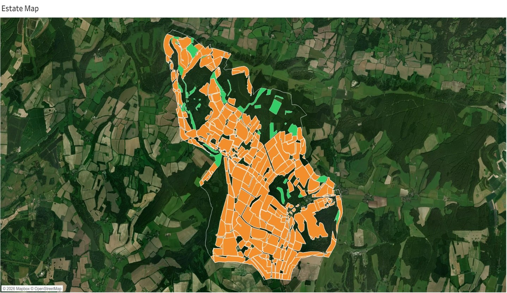
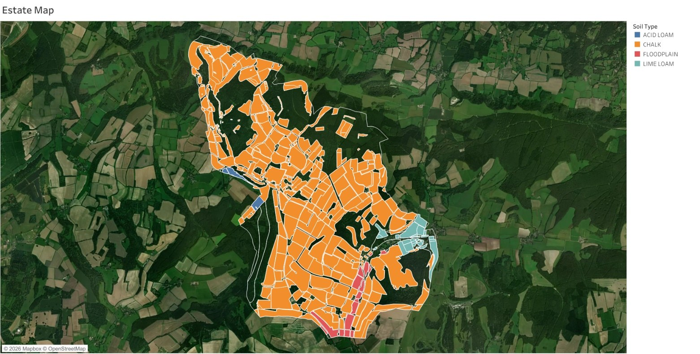

# Methodology: the five-stage pipeline

[← Back to README](../README.md) · [Dashboards](02_dashboard_guide.md) · [Results](03_results.md) · [Species palette](04_species_palette.md) · [Data & governance](05_data_and_governance.md) · [Limitations](06_limitations_and_future_work.md) · [References](07_references.md)

The tool turns a single estate boundary polygon into a costed, credit-quantified planting plan. Each stage consumes the output of the one before it, so the order is a genuine dependency chain: land → soil → species → carbon → money.


---

## Stage 1 · Spatial preparation

**Question answered:** where can new woodland go, and how much land is there? (RQ1)

| Step | What happened |
|---|---|
| Dataset-driven segregation | The estate boundary was overlaid with the National Forest Inventory (existing woodland), OS Open Map Local buildings and roads, and OS Open Greenspace / OpenStreetMap farmland. |
| Manual digitisation | Residual areas none of the datasets classified were hand-digitised in Google Earth, using the sponsor's cartographic map as a guide. |
| Cleaning | Two inconsistent names fixed; 32 Tree Patch polygons under 500 m² removed as digitisation noise. |
| Deduplication | 48 Farm names appeared twice with near-identical geometry (the same field drawn in two sessions). Resolved with **Algorithm 3.1**, below. |
| Reprojection | All geometry reprojected from WGS84 (EPSG:4326) to **British National Grid (EPSG:27700)** before measuring area, because degree-based coordinates distort hectares at UK latitudes. |

### Algorithm 3.1 · Greedy non-maximum suppression

Name-matching alone could not separate true duplicates from distinct neighbouring fields with similar names, so overlap geometry decided it.

```text
Input:  P = {p1 … pn} raw digitised polygons, threshold τ = 0.5
Output: R  retained (deduplicated) polygons

R ← ∅
sort P by area, largest first
for each p in P:
    for each q in R:
        overlap ← area(p ∩ q) / min(area(p), area(q))
        if overlap ≥ τ:
            log (p, q, overlap) to audit trail
            mark p as duplicate; break
    if p is not a duplicate: R ← R ∪ {p}
return R
```

Overlap is measured against the **smaller** polygon's area. The empirical distribution was bimodal: true duplicates overlapped by 93–100 %, adjacent fields by under 5 %. No polygon fell in between, so τ = 0.5 carried no risk of misclassification.

**Effect:** 28 duplicate Farm polygons removed, correcting Farm area from an inflated **2,069.8 ha** (212.6 ha double-counted) to **1,855.7 ha**. Residual overlap fell to 0.44 ha of ordinary shared boundaries. A tested Python version lives in [`src/wcc_carbon/dedup.py`](../src/wcc_carbon/dedup.py).

### Output

| Category | Sites | Area (ha) | Share of estate |
|---|--:|--:|--:|
| Farm planting sites | 322 | 1,855.7 | 55.0 % |
| Woodland planting sites | 62 | 127.1 | 3.8 % |
| **Plantable total** | **384** | **1,982.8** | **58.8 %** |
| Tree Patch exclusions | 10 | 1.7 | 0.05 % |
| Estate total | | 3,371.8 | 100 % |

<p align="center"></p>

---

## Stage 2 · Soil classification

**Question answered:** what kind of ground is each parcel?

NATMAP's national layer (42,603 polygons) was clipped to the estate, leaving 10 polygons across **six soil series**. Each parcel took its dominant series by area of overlap. The six series were consolidated into **four ecologically coherent zones**, grouped by the soil moisture regime (SMR) and soil nutrient regime (SNR) that ESC uses downstream:

| Zone | NATMAP series | Why grouped |
|---|---|---|
| Chalk | Andover 1, Andover 2, Upton 1 | Return identical SMR/SNR inputs to ESC, so identical species outputs |
| Lime Loam | Coombe 1 | |
| Floodplain | Frome | |
| Acid Loam | Carstens | |

| Zone | Sites | Area (ha) | Share of plantable |
|---|--:|--:|--:|
| Chalk | 334 | 1,840.79 | **92.9 %** |
| Lime Loam | 29 | 67.24 | 3.4 % |
| Floodplain | 16 | 59.75 | 3.0 % |
| Acid Loam | 5 | 14.98 | 0.8 % |

Chalk dominance is the single most consequential spatial fact in the project. It means any estate-scale outcome is, in practice, a chalk outcome (chalk produces about 96 % of Scenario A's sequestration), while the three small soils become the estate's only real route to species diversity.

<p align="center"></p>

---

## Stage 3 · Species suitability and locking

**Question answered:** what should be planted on each soil? (RQ2)

### ESC queries
One representative grid reference per zone was run through Forest Research's **Ecological Site Classification** (1961–1990 climate baseline), which scores each species 0–1 against the site's climate, SMR and SNR.

| Zone | Grid ref | SMR | SNR |
|---|---|---|---|
| Chalk | SU 826 146 | 7.0 Moderately dry | 6.0 Carbonate |
| Lime Loam | SU 874 130 | 5.0 Fresh | 6.0 Carbonate |
| Floodplain | SU 855 116 | 3.0 Very moist | 4.0 Rich |
| Acid Loam | SU 817 147 | 6.0 Slightly dry | 4.0 Rich |

**The carbonate-defaults correction.** ESC's default soil regime (SMR 7.0 / SNR 6.0) is calibrated for calcareous soils. The first run used it for all four zones and returned near-identical recommendations everywhere, which an ecologically varied estate should not produce. The regimes were re-specified from each NATMAP series' documented properties. Pedunculate oak confirms the fix: 0.03 on corrected Chalk, 0.90 on corrected Floodplain, matching its known preference for moist soils.

### The largest-soil-claims-first rule
A design brief agreed with the sponsor fixed a **locked palette of 8 species per soil (32 total)**. Three alternatives were rejected:

| Approach | Why rejected |
|---|---|
| Independent top-8 per soil | Generalists (Beech, Sycamore, Wild cherry) repeat across soils, leaving perhaps 18–20 unique species instead of 32 |
| Optimisation (bipartite assignment / Hungarian algorithm) | Optimises a single ESC objective and produces a palette the sponsor cannot see the reasoning behind |
| Area-weighted score | Needs two arbitrary weights for little interpretive gain |

**Adopted rule:** soils choose in descending order of plantable area. Chalk takes its top 8 by ESC score, then Lime Loam picks from what is left, then Floodplain, then Acid Loam. On the three smaller soils, a native species wins any tie within about 0.05.

The cost is deliberate and visible: Beech scores 0.93 on Acid Loam and 0.73 on Lime Loam but is locked to Chalk at 0.51, because Chalk chose first. The rule trades a little per-soil optimality for estate-wide diversity, and any placement can be explained to the sponsor in one sentence. The full palette is in [Species palette](04_species_palette.md).

**Where the central finding is born.** ESC ranks species by ecological fit, but the Woodland Carbon Code credits carbon by yield class (growth rate). On chalk the two point in different directions, so an ecology-led palette already implies giving up some carbon. Stage 5 measures that gap.

---

## Stage 4 · Carbon engine

**Question answered:** how much carbon, and how many claimable credits?

The engine reproduces the **WCC v3.0 biomass lookup table verbatim (19,041 rows)**: cumulative sequestration per hectare as a function of growth model *g*, spacing *s*, yield class *y*, management *m* and time *t*, over 200 years in 5-year steps. Reproducing rather than re-implementing it keeps every output directly comparable with a real WCC submission.

Ten growth models cover the 32 species (SAB, BE, OK, SP, LEC, RC, NS, NF, LP, CP). **18 of the 32 species map to the generic broadleaf model SAB**, so their carbon trajectories cannot be told apart.

### Planting density (informational)

$$N_{\text{square}}(s) = \frac{10{,}000}{s^{2}} \qquad N_{\text{triangular}}(s) = \frac{20{,}000}{s^{2}\sqrt{3}} \approx \frac{11{,}547}{s^{2}}$$

Triangular packing is about 15.5 % denser. The lookup table is indexed by spacing, not layout, so layout guides seedling procurement and fencing but does not change per-hectare carbon.

### Gross sequestration

$$Q_i(t) = A_i \cdot L(g_i, s_i, y_i, m_i, t) \qquad Q_{\text{estate}}(t) = \sum_{Z}\sum_{i \in Z} Q_i(t)$$

### Gross → net → claimable PIUs

| Step | Formula | Meaning |
|---|---|---|
| Model-precision reduction | $C(t) = 0.80 \cdot Q_{\text{estate}}(t)$ | Code's conservatism for model uncertainty |
| Baseline & leakage | $F(t) = C(t) - L_b$, with $L_b = 60$ tCO₂e | One-off lumped deduction from the certified Phase 1 record (−60.45, rounded) |
| Buffer | $G(t) = 0.20 \cdot F(t)$ | Withheld as insurance against fire, disease, windthrow |
| PIUs at vintage *v* | $\text{PIU}(v) = 0.80\,[F(v) - F(v^-)]$ | Issued at the 11 verification years |

$$\mathcal{V} = \{5, 15, 25, 35, 45, 55, 65, 75, 85, 95, 100\}$$

$$\boxed{\;\text{PIU}_{\text{total}} = 0.64 \cdot Q_{\text{estate}}(100) - 0.80 \cdot L_b\;}$$

**Worked example (Scenario A):** 0.64 × 983,882 − 0.80 × 60 = 629,684.5 − 48 = **629,636 tCO₂e**. On that scale the fixed L_b changes the result by 0.008 %. Scaling establishment emissions with area (≈ 1.97 t/ha × 1,982.8 ha ≈ 3,900 t) would move it by about 0.4 %, which is listed as future work.

### Validation against a certified project

The engine was configured to the sponsor's **WCC-certified Phase 1 project** (30.69 ha, 25-species native broadleaf mix) with the palette restriction bypassed, and its per-vintage output compared with the certified figures. Criterion: |PIU_tool(v) − PIU_cert(v)| < 1 tCO₂e at every vintage.

| Vintage | Tool PIUs | Certified PIUs | Difference |
|--:|--:|--:|--:|
| 5 | 18 | 18 | 0 |
| 15 | 702 | 701 | +1 (rounding) |
| 25 | 1,986 | 1,986 | 0 |
| 35 | 1,446 | 1,446 | 0 |
| 45 | 820 | 820 | 0 |
| 55 | 515 | 515 | 0 |
| 65 | 335 | 335 | 0 |
| 75 | 221 | 221 | 0 |
| 85 | 145 | 145 | 0 |
| 95 | 95 | 95 | 0 |
| 100 | 27 | 27 | 0 |
| **Total** | **6,310** | **6,309** | **+1 (0.02 %)** |

Three internal checks ran alongside: area totals reconcile to the inventory in every scenario; every polygon removed by deduplication was reviewed by hand; the 20 % buffer and 20 % model-precision chains were checked against manual calculations for sample species.

---

## Stage 5 · Financial model

**Question answered:** what is the carbon worth, and when does the money arrive? (RQ3)

$$R(v) = p \cdot \text{PIU}(v) \qquad R_{\text{total}} = p \cdot \text{PIU}_{\text{total}}$$

* **Central price** p = **£26.85 / tCO₂e**, the WCC's published 2024 average PIU price.
* **Sensitivity band** £10 ≤ p ≤ £30, the observed 2020–2024 auction range. Because revenue is linear in price, the band is always a factor of three (£30 / £10), whatever the planting design.
* **Timing.** Issuance follows the 11 verification years, which concentrates income in the fast-growth decades.

**Deliberately partial.** The model reports gross carbon revenue only: no establishment, management or verification costs, no EWCO grant income, no discounting. Each of those needs assumptions the sponsor has not made, and leaving them out keeps the reported figure a pure application of the Code's accounting to market prices. The estate nets it against its own costs and grants.

---

## Tools

| Purpose | Tool |
|---|---|
| Cleaning, deduplication, soil tagging, reprojection, area | Python · GeoPandas · Shapely · Pandas |
| Lookup-table extraction from the Carbon Calculator | Python · OpenPyXL |
| Manual digitisation | Google Earth |
| Species suitability | Forest Research ESC web tool |
| Decision-support tool | Tableau Desktop → Tableau Public |

**Why Tableau and not Power BI?** The sponsor works in Microsoft tools, but Tableau's spatial polygon handling and its Set and Parameter Actions suited the click-a-parcel interaction at the heart of the tool. The analytical tables sit upstream of the visual layer, so they can be reconnected in Power BI later without reworking the model.

**Reproducibility.** Cleaning, deduplication, the soil join, reprojection and lookup extraction are scripted and return identical outputs on re-run. Manual digitisation and the ESC web queries are not scripted, but the recorded grid references and SMR/SNR values make the ESC queries exactly repeatable, and every ESC report was saved.
