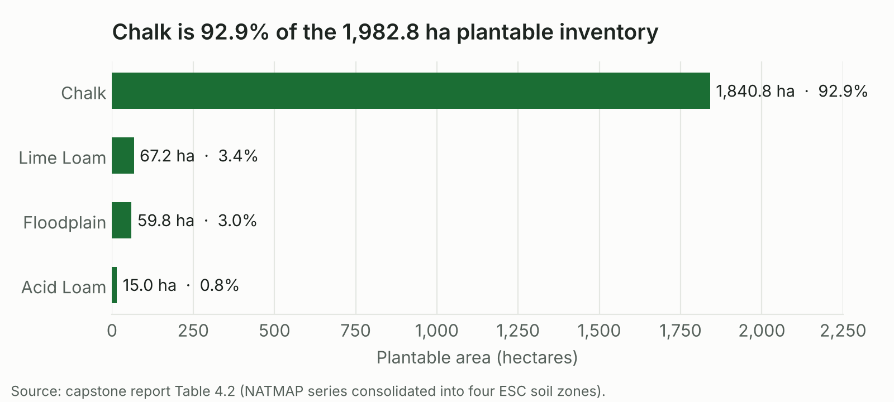
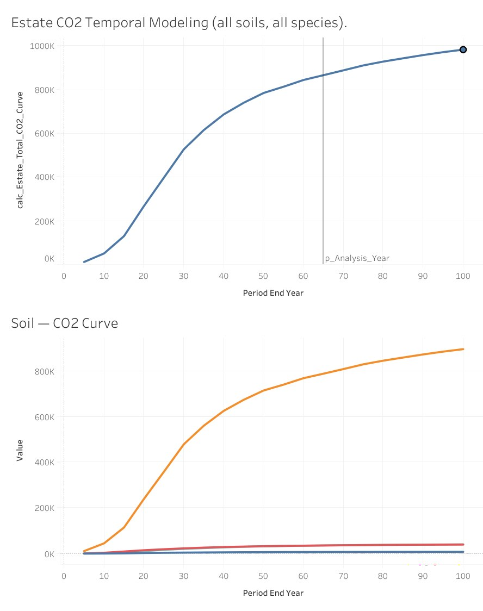
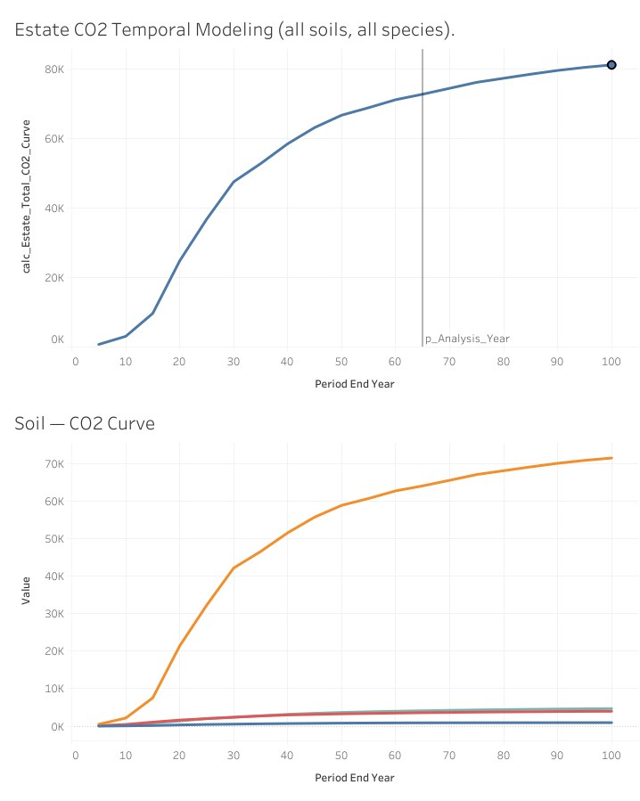
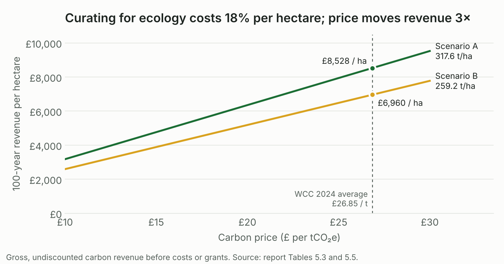
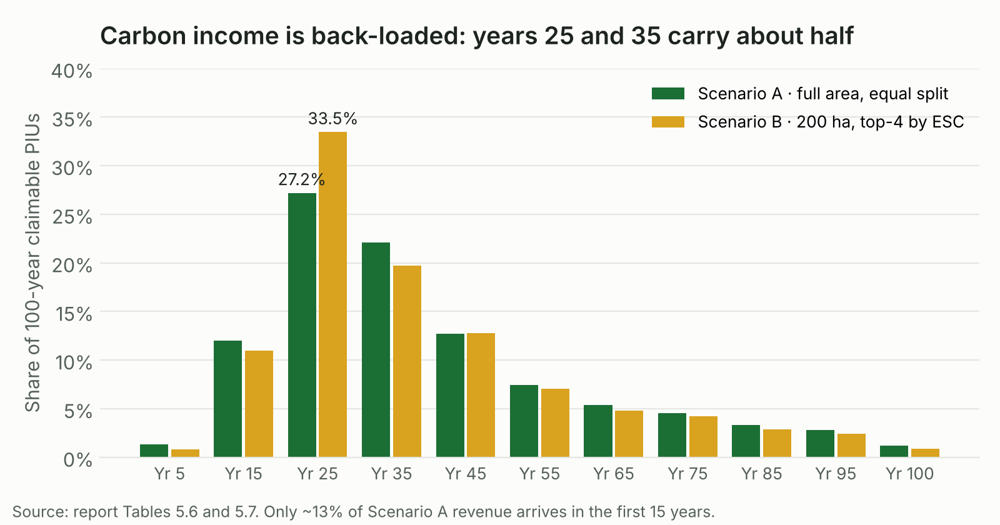
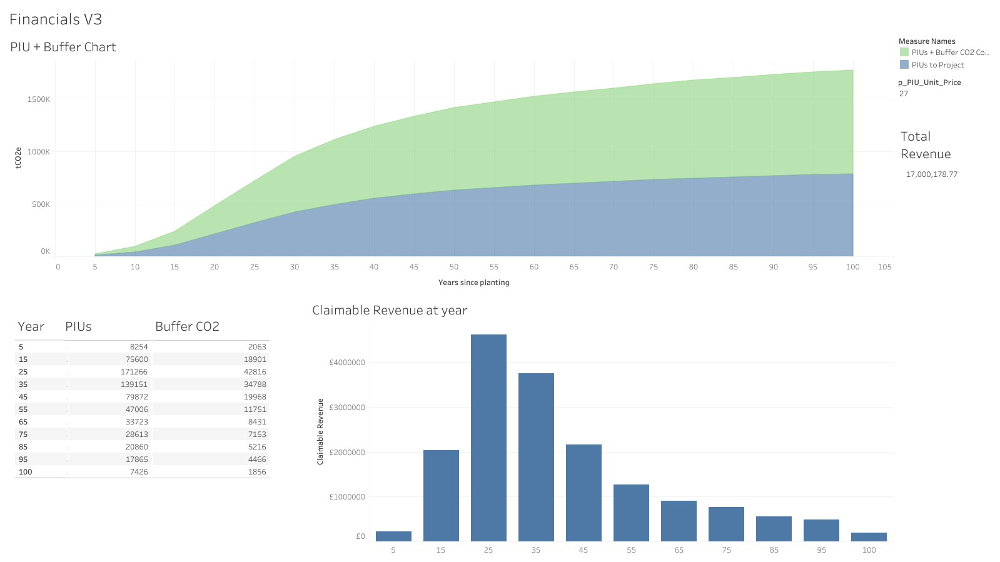
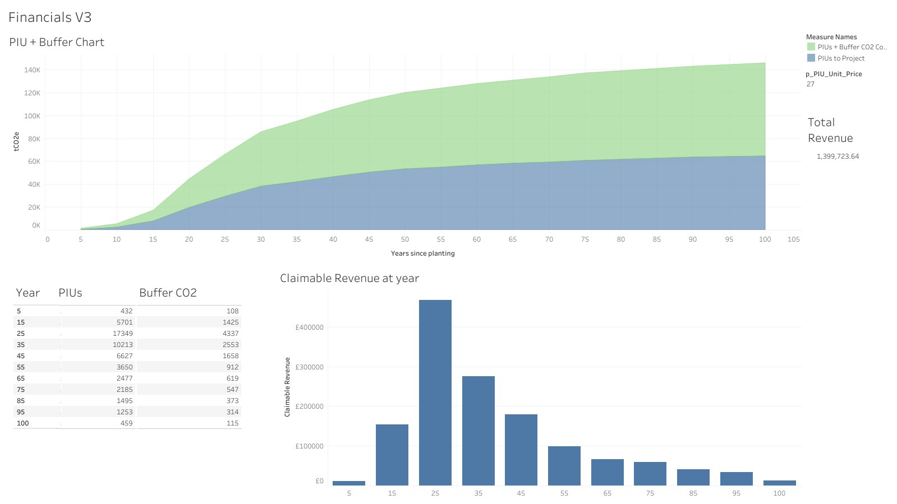

# Results

[← Back to README](../README.md) · [Methodology](01_methodology.md) · [Dashboards](02_dashboard_guide.md) · [Species palette](04_species_palette.md) · [Data & governance](05_data_and_governance.md) · [Limitations](06_limitations_and_future_work.md) · [References](07_references.md)

All figures are indicative model projections over a 100-year WCC project duration, at ESC-default spacing and yield class, all stands thinned, analysis year 65. Revenue is gross carbon revenue only. Every table here is also in [`data/`](../data) as CSV.

---

## RQ1 · Where can woodland go, and how much?

**1,982.8 ha of plantable land (58.8 % of the 3,371.8 ha estate) across 384 parcels.** That is 65 times the 30.69 ha already certified in Phase 1, so the binding constraint on ambition is decision-making, not land.

---

## RQ2 · What to plant, and what it sequesters

Two scenarios were designed **by the project team** to bracket what the tool can produce. Neither is a planting proposal.

| | Scenario A | Scenario B |
|---|---|---|
| **Design rule** | Full plantable area; each soil's 8 locked species split equally | ~200 ha (≈ 10 % of the inventory); top 4 species by ESC score per soil |
| **Chalk species** | All 8 | Wild service tree, Italian alder, Hornbeam, Norway maple |
| **Lime Loam species** | All 8 | Wild cherry, Small-leaved lime, Western red cedar, Serbian spruce |
| **Floodplain species** | All 8 | Black poplar, Lodgepole pine, Macedonian pine, Common alder |
| **Acid Loam species** | All 8 | Rauli beech, Rowan, Scots pine, Holly |

| Metric | Scenario A | Scenario B | Gap |
|---|--:|--:|--:|
| Planted area (ha) | 1,982.76 | ~200 | 10× |
| Gross CO₂e at year 65 (t) | 867,063 | 72,652 | |
| Gross CO₂e at year 100 (t) | 983,882 | 81,078 | 12.1× |
| Buffer withheld over 100 years (t) | 157,409 | 12,961 | |
| **Claimable PIUs at year 100 (t)** | **629,636** | **51,841** | 12.1× |
| **PIUs per hectare (t/ha)** | **317.6** | **259.2** | **−18.4 %** |
| Year-25 share of 100-year PIUs | 27.2 % | 33.5 % | B more front-loaded |
| Cumulative PIUs to year 65 | 88.1 % | 89.6 % | |

<table>
<tr>
<td width="50%"> <b>Scenario A.</b> Estate and per-soil gross sequestration. Chalk contributes about 96 %.</td>
<td width="50%"> <b>Scenario B.</b> Same shape at one-twelfth the scale.</td>
</tr>
</table>

Scenario A runs 54 % above Phase 1's per-hectare rate (205.6 t/ha) because the equal split includes the palette's high-yield conifers (Norway spruce at YC 22, Lodgepole pine, Scots pine, the firs), which Phase 1 excluded by design.

---

## The central finding · the 18 % question

> **Plant the species the ecologist ranks highest and you sequester 18 % less carbon per hectare.** That is not a modelling fault. The Woodland Carbon Code credits carbon by **yield class** (growth rate), not by **ecological suitability**, and on chalk the two point in opposite directions.

On chalk, the top-4 ESC species sit at moderate yield classes, while the fastest growers in the equal split (Willow SRC, Leyland cypress) score lower on suitability. Curating for fit therefore selects against carbon.

Applied to the full 1,982.8 ha, Scenario B's per-hectare rate would earn about **£13.80 M** against Scenario A's **£16.91 M**: a **£3.11 M cost of ecological curation**. The tool does not decide whether that price is worth paying. It puts the number in front of the estate so the choice is made knowingly.

---

## RQ3 · What is the carbon worth?

### At the central price (£26.85 / tCO₂e)

| Scenario | Area (ha) | PIUs at year 100 | 100-year revenue | Revenue to year 65 | Revenue per ha |
|---|--:|--:|--:|--:|--:|
| A · full plantable area | 1,982.8 | 629,636 | **£16.91 M** | £14.90 M | £8,528 |
| B · curated 200 ha | ~200 | 51,841 | **£1.39 M** | £1.25 M | £6,960 |

### Price sensitivity

| Scenario | £10 / t | £26.85 / t | £30 / t | Range |
|---|--:|--:|--:|--:|
| A · full plantable area | £6.30 M | £16.91 M | £18.89 M | £12.59 M |
| B · curated 200 ha | £0.52 M | £1.39 M | £1.56 M | £1.04 M |

Revenue is linear in price, so every design carries the same factor-of-three spread, roughly ±40 % around the central figure. **Market price moves revenue more than any species choice does at a given scope.**

### Timing

| Vintage | A · PIUs (t) | A · buffer (t) | A · revenue | B · PIUs (t) | B · buffer (t) | B · revenue |
|--:|--:|--:|--:|--:|--:|--:|
| 5 | 8,254 | 2,063 | £221,620 | 432 | 108 | £11,599 |
| 15 | 75,600 | 18,901 | £2,029,860 | 5,701 | 1,425 | £153,072 |
| **25** | **171,266** | 42,816 | **£4,598,492** | **17,349** | 4,337 | **£465,821** |
| **35** | **139,151** | 34,788 | **£3,736,204** | **10,213** | 2,553 | **£274,219** |
| 45 | 79,872 | 19,968 | £2,144,563 | 6,627 | 1,658 | £177,935 |
| 55 | 47,006 | 11,751 | £1,262,111 | 3,650 | 912 | £98,002 |
| 65 | 33,723 | 8,431 | £905,463 | 2,477 | 619 | £66,507 |
| 75 | 28,613 | 7,153 | £768,259 | 2,185 | 547 | £58,667 |
| 85 | 20,860 | 5,216 | £560,091 | 1,495 | 373 | £40,141 |
| 95 | 17,865 | 4,466 | £479,675 | 1,253 | 314 | £33,643 |
| 100 | 7,426 | 1,856 | £199,388 | 459 | 115 | £12,324 |
| **Total** | **629,636** | **157,409** | **£16,905,727** | **51,841** | **12,961** | **£1,391,931** |

* Years 25 and 35 together deliver **≈ 49 %** of Scenario A's 100-year revenue.
* Only **≈ 13 %** arrives in the first 15 years, so carbon sales cannot fund planting. Establishment at £5,000–£7,000 / ha would cost roughly £10–14 M at full scale, years before the peak vintages pay out.

<table>
<tr>
<td width="50%"> <b>Scenario A</b> in the Financials view (tool default £27 / t).</td>
<td width="50%"> <b>Scenario B</b> in the Financials view (tool default £27 / t).</td>
</tr>
</table>

---

## Patterns across the scenarios

| Pattern | What it means for the estate |
|---|---|
| **Scale is roughly linear** | Ten times the area gives roughly ten times the carbon and revenue |
| **Species choice matters at the margin** | The 18 % per-hectare gap is structural to the Code's yield-class basis |
| **Price uncertainty dominates** | ±40 % from the market outweighs any design decision at a given scope |
| **Timing is uneven** | About half of 100-year revenue lands in one decade (years 25–35) |

## Recommendations to West Dean

1. **Use the tool for scenario exploration, not as investment-grade figures.** Compare several designs in an afternoon and learn how the numbers move.
2. **Re-run ESC under future-climate (UKCP18) scenarios before any Phase 2 validation.** WCC v3.0 requires future-climate suitability, so the current palette is not yet certification-ready.
3. **Net revenue against costs and grants.** Commission a fuller appraisal that includes establishment, management, verification and EWCO income.
4. **Adopt a mixed allocation strategy.** Yield-led on chalk, where the carbon is won; curated on the three small soils, where ecology costs least.
5. **Publish figures with the framing explicit:** model projections at a stated price, not guaranteed revenue.
