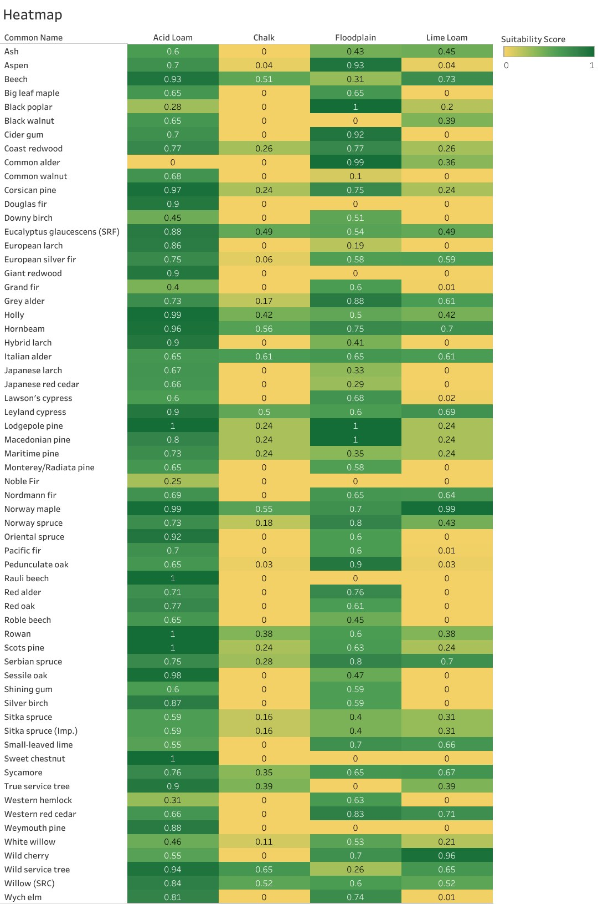

# The 32-species locked palette

[← Back to README](../README.md) · [Methodology](01_methodology.md) · [Dashboards](02_dashboard_guide.md) · [Results](03_results.md) · [Data & governance](05_data_and_governance.md) · [Limitations](06_limitations_and_future_work.md) · [References](07_references.md)

Eight species per soil, locked by the **largest-soil-claims-first** rule (Chalk chose first, then Lime Loam, Floodplain and Acid Loam from what remained; native status breaks near-ties on the three smaller soils). ESC scores are on the species' locked soil, 1961–1990 climate baseline. CSV: [`data/species_palette.csv`](../data/species_palette.csv).

### Chalk · 1,840.79 ha · 92.9 %

| # | Species | Scientific name | WCC model | Status | ESC |
|--:|---|---|:-:|---|--:|
| 1 | Wild service tree | *Sorbus torminalis* | SAB | Native | 0.65 |
| 2 | Italian alder | *Alnus cordata* | SAB | Non-native | 0.61 |
| 3 | Hornbeam | *Carpinus betulus* | BE | Native | 0.56 |
| 4 | Norway maple | *Acer platanoides* | SAB | Non-native | 0.55 |
| 5 | Willow (SRC) | *Salix viminalis* | SAB | Non-native | 0.52 |
| 6 | Beech | *Fagus sylvatica* | BE | Native | 0.51 |
| 7 | Leyland cypress | *Cuprocyparis leylandii* | LEC | Non-native | 0.50 |
| 8 | Eucalyptus glaucescens | *Eucalyptus glaucescens* | SAB | Non-native | 0.49 (marginal) |

### Lime Loam · 67.24 ha · 3.4 %

| # | Species | Scientific name | WCC model | Status | ESC |
|--:|---|---|:-:|---|--:|
| 1 | Wild cherry | *Prunus avium* | SAB | Native | 0.96 |
| 2 | Small-leaved lime | *Tilia cordata* | SAB | Native | 0.66 |
| 3 | Western red cedar | *Thuja plicata* | RC | Non-native | 0.71 |
| 4 | Serbian spruce | *Picea omorika* | NS | Non-native | 0.70 |
| 5 | Sycamore | *Acer pseudoplatanus* | SAB | Non-native | 0.67 |
| 6 | Nordmann fir | *Abies nordmanniana* | NF | Non-native | 0.64 |
| 7 | Grey alder | *Alnus incana* | SAB | Non-native | 0.61 |
| 8 | European silver fir | *Abies alba* | NF | Non-native | 0.59 |

Small-leaved lime ranks above higher-scoring non-natives here because of the native tie-breaker.

### Floodplain · 59.75 ha · 3.0 %

| # | Species | Scientific name | WCC model | Status | ESC |
|--:|---|---|:-:|---|--:|
| 1 | Black poplar | *Populus nigra* | SAB | Native | 1.00 |
| 2 | Common alder | *Alnus glutinosa* | SAB | Native | 0.99 |
| 3 | Aspen | *Populus tremula* | SAB | Native | 0.93 |
| 4 | Pedunculate oak | *Quercus robur* | OK | Native | 0.90 |
| 5 | Lodgepole pine | *Pinus contorta* | LP | Non-native | 1.00 |
| 6 | Macedonian pine | *Pinus peuce* | CP | Non-native | 1.00 |
| 7 | Cider gum | *Eucalyptus gunnii* | SAB | Non-native | 0.92 |
| 8 | Norway spruce | *Picea abies* | NS | Non-native | 0.80 |

### Acid Loam · 14.98 ha · 0.8 %

| # | Species | Scientific name | WCC model | Status | ESC |
|--:|---|---|:-:|---|--:|
| 1 | Scots pine | *Pinus sylvestris* | SP | Native | 1.00 |
| 2 | Rowan | *Sorbus aucuparia* | SAB | Native | 1.00 |
| 3 | Holly | *Ilex aquifolium* | SAB | Native | 0.99 |
| 4 | Sessile oak | *Quercus petraea* | OK | Native | 0.98 |
| 5 | True service tree | *Sorbus domestica* | SAB | Native (rare) | 0.90 |
| 6 | Silver birch | *Betula pendula* | SAB | Native | 0.87 |
| 7 | Wych elm | *Ulmus glabra* | BE | Native | 0.81 |
| 8 | Rauli beech | *Nothofagus alpina* | SAB | Non-native | 1.00 |

---

## Growth models and valid ranges

The WCC lookup table only contains certain spacing and yield-class combinations per growth model; the Mix Configuration menus are restricted to these so every configuration has a matching row.

| Model | Description | Valid spacing (m) | Valid yield class | Species |
|:-:|---|---|---|--:|
| SAB | General broadleaf | 1.5, 2.5, 3, 4, 5 | 2–12 (even) | 18 |
| BE | Beech and similar | 1.2, 2.5, 3, 4, 5 | 2–10 (even) | 3 |
| OK | Oak | 1.2, 2.5, 3, 4, 5 | 2–8 (even) | 2 |
| SP | Scots pine | 1.4, 2, 2.5, 3, 4, 5 | 2–14 (even) | 1 |
| LEC | Leyland cypress | 1.5 | 12–24 (even) | 1 |
| RC | Western red cedar | 1.5 | 12–24 (even) | 1 |
| NS | Norway spruce group | 1.5 | 6–22 (even) | 2 |
| NF | Nordmann and silver fir | 1.5 | 10–22 (even) | 2 |
| LP | Lodgepole pine | 1.5 | 4–14 (even) | 1 |
| CP | Corsican pine group | 1.4 | 6–20 (even) | 1 |

Two mapping corrections were made during development: Hornbeam and Wych elm map to **BE**, not SAB as early iterations assumed.

> **Limitation.** 18 of 32 species share the generic SAB curve, so the tool can tell them apart ecologically (ESC) but not on per-hectare carbon. This is inherited from the Code, which publishes no species-specific models for those broadleaves.

---

## Suitability heatmap

Every candidate species scored on all four soils. The locked palette above is drawn from this matrix; reading across a row shows the trade-off the locking rule makes (Beech: Chalk 0.51, Lime Loam 0.73, Acid Loam 0.93, locked to Chalk).

